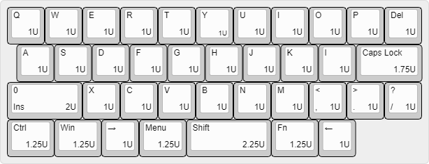
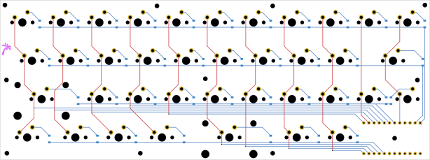

## Coconut
It's a keyboard which has 38 keys!</br>
You can use ANSI 104 layout keycaps for this keyboard.





## Used web site, software and library for this project.
1. http://www.keyboard-layout-editor.com/
2. https://kb.xyz.is/
3. https://msys.qmk.fm/
4. https://kbfirmware.com/
5. https://www.kicad.org/
6. https://github.com/g200kg/kicad-lib-arduino

## LICENCE

```
MIT License

Copyright (c) 2022 Koutarou Mori

Permission is hereby granted, free of charge, to any person obtaining a copy
of this software and associated documentation files (the "Software"), to deal
in the Software without restriction, including without limitation the rights
to use, copy, modify, merge, publish, distribute, sublicense, and/or sell
copies of the Software, and to permit persons to whom the Software is
furnished to do so, subject to the following conditions:

The above copyright notice and this permission notice shall be included in all
copies or substantial portions of the Software.

THE SOFTWARE IS PROVIDED "AS IS", WITHOUT WARRANTY OF ANY KIND, EXPRESS OR
IMPLIED, INCLUDING BUT NOT LIMITED TO THE WARRANTIES OF MERCHANTABILITY,
FITNESS FOR A PARTICULAR PURPOSE AND NONINFRINGEMENT. IN NO EVENT SHALL THE
AUTHORS OR COPYRIGHT HOLDERS BE LIABLE FOR ANY CLAIM, DAMAGES OR OTHER
LIABILITY, WHETHER IN AN ACTION OF CONTRACT, TORT OR OTHERWISE, ARISING FROM,
OUT OF OR IN CONNECTION WITH THE SOFTWARE OR THE USE OR OTHER DEALINGS IN THE
SOFTWARE.
```

This project was developped using a lot of software, etc.</br>
and I couldn't understand license of all.</br>
If there are any infringement, please contact me.

As shown above, this project is basically licensed under MIT license,</br>
but The files in /qmk-firmware and firmware.hex in releases page are licensed under GPL v3 license.

Sharing gerber_nonfree.zip in releases page is prohibited.
